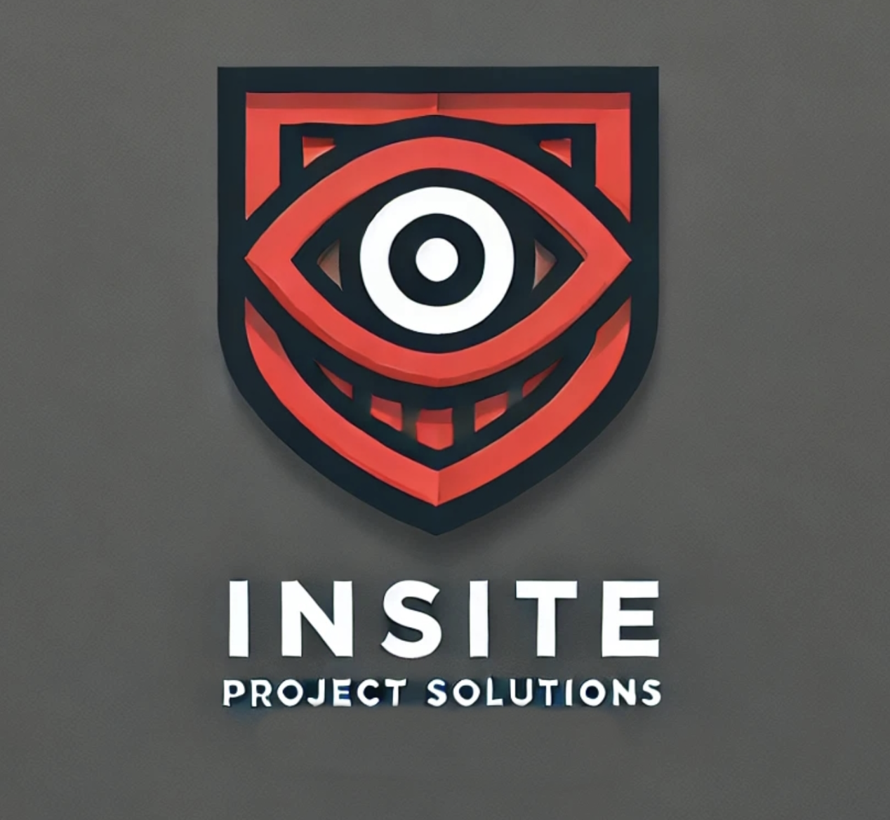

# p05c-rpi-gpu
## High Performance Multi-Stream Camera System for Raspberry Pi

## Project Info

#### Team: P05C

#### University/Canvas Name: COMP3888_M12_02

#### Tutor: Lin Zhang \[[lzha8455@uni.sydney.edu.au](mailto:lzha8455@uni.sydney.edu.au)\]

### Team Members

| Name               | SID       | Unikey   | Email                      |
| ------------------ | --------- | -------- | -------------------------- |
| Andrei Agnew       | 510471659 | aagn5279 | aagn5279@uni.sydney.edu.au |
| Alistair MacDonald | 510465636 | amac2328 | amac2328@uni.sydney.edu.au |
| Daniel Miu         | 510423924 | dmiu7957 | dmiu7957@uni.sydney.edu.au |
| Eleanor Taylor     | 540908525 | etay0703 | etay0703@uni.sydney.edu.au |
| Grant Dong         | 510472058 | gdon7480 | gdon7480@uni.sydney.edu.au |
| Patrick Sparks     | 440181875 | pspa2200 | pspa2200@uni.sydney.edu.au |

### Client Information

| Name           | Email                       |
| -------------- | --------------------------- |
| Cian Byrne     | cian.byrne@coliemore.com.au |
| Kitt Morjanova | kitt@mailington.com         |

### Documentation

Our Documentation in Confluence can be found at [https://comp3888-m12-02-2024.atlassian.net/wiki/spaces/COMP3888M1/overview](https://comp3888-m12-02-2024.atlassian.net/wiki/spaces/COMP3888M1/overview)

<br>

 

<br>

# rpicam-mjpeg
### A fork of Raspberry Pi's [rpicam-apps](https://www.github.com/raspberrypi/rpicam-apps) suite of camera apps that includes a modernised version of [RaspiMJPEG](https://github.com/roberttidey/userland/tree/master/host_applications/linux/apps/raspicam)
RaspiMJPEG was a camera app for the Raspberry Pi based on the MMAL API. This camera API has since been deprecated in modern Raspberry Pi systems in favour of the standardised Linux V4L2 Camera API.

RaspiMJPEG was originally developed by combining the existing `RaspiVid` and `RaspiStill` apps into one app that could support up to three simultaneous streams - an MJPEG preview stream, a video recording stream, and an image capture stream. MMAL was able to support this level of concurrency, and so RaspiMJPEG could easily handle these streams. It was also interfaceable via commands supplied in a named pipe, allowing other apps to easily communicate with it.

Since the Raspberry Pi 4, MMAL is no longer supported, and has been replaced with the more standardised V4L2 camera API. This is the API used by *libcamera*, a high level Linux camera API. **rpicam-apps** uses a fork of libcamera in its suite of apps, which allows for more accessible development, and so **rpicam-mjpeg** has been written in a similar way as the other apps in this suite. Unfortunately, *libcamera* does not currently support multiple streams to the same extent as the MMAL drivers, and has a maximum of two streams with custom pixel formats and colourspaces, as well as a stream with RAW Bayer pixel data. Whilst this is the same number of streams as RaspiMJPEG, the caveat of one of these being a RAW stream introduces an element of speed VS quality to rpicam-mjpeg.

## Setup

1.   Clone the repository and enter the `rpicam-apps` directory.

     ```sh
     git clone https://github.com/consiliumsolutions/p05c-rpi-gpu
     cd p05c-rpi-gpu/rpicam-apps
     ```

2.   Run the following command to install all required dependencies.

     ```sh
     sudo apt install libboost-all-dev libunwind-dev ninja-build libboost-dev libgnutls28-dev openssl libtiff-dev pybind11-dev  qtbase5-dev libqt5core5a libqt5widgets5 cmake python3-yaml  python3-ply libglib2.0-dev libgstreamer-plugins-base1.0-dev  libdrm-dev libexif-dev libavcodec-dev libavdevice-dev libcamera-dev  libpng-dev libepoxy-dev libboost-program-options-dev libopencv-dev  python3-dev python3-pip dcraw netpbm libjpeg-dev libjpeg-turbo-progs  python3-pybind11 meson ninja-build
     ```

3.   You can either run `sudo make install` in the build directory, or follow the same rpicam-apps installation steps (below) to customise your setup.
     Note that for motion-detection to work, `-Denable_opencv=enabled` must be present in the meson setup command flags.
     ```sh
     meson setup build -Denable_libav=enabled -Denable_drm=enabled -Denable_egl=enabled -Denable_qt=enabled -Denable_opencv=enabled -Denable_tflite=disabled
     meson compile -C build
     sudo meson install -C build
     sudo ldconfig
     ```


## Usage
rpicam-mjpeg works best when in combination with silvanmelchior's [RPi_Cam_Web_Interface](https://github.com/consiliumsolutions/RPi_Cam_Web_Interface/tree/p05c/install-changes), but can also work as a standalone app. 

The [official Raspberry Pi Camera documentation](https://www.raspberrypi.com/documentation/computers/camera_software.html) has lots of information about the parameters accepted by its apps. **rpicam-mjpeg** was designed to as much as possible slot into the existing apps, and so almost all options supported by both rpicam-vid and rpicam-still are supported by rpicam-mjpeg. A Notable exlusion is the custom autofocus mode of rpicam-still.

Below is a list of new command line arguments supported by **rpicam-mjpeg**:
| Command                                           | Description                                                  |
| :------------------------------------------------ | ------------------------------------------------------------ |
| `--width`                                         | Width of the video stream                                    |
| `--height`                                        | Height of the video stream                                   |
| `--lores-width`                                   | Width of the low-resolution MJPEG preview stream             |
| `--lores-height`                                  | Hieght of the low-resolution MJPEG preview stream            |
| `--image-width`                                   | Width of the image stream                                    |
| `--image-mode`                                    | Height of the image stream                                   |
| `--video-output`                                  | Output path of the video stream. Supports datetime %Y %m $d %H %M %S, as well as %i to include an increment in the output path. |
| `--preview-output`                                | Output path of the MJPEG stream. Defaults to "/dev/shm/mjpeg/cam.jpg" to reduce SD card load. Supports same annotations as above |
| `--image-output`                                  | Output path of the image stream. Supports same annotations as above. |
| `--image-mode`                                    | Set the mode for the image stream. See [the rpicam-apps documenation](https://www.raspberrypi.com/documentation/computers/camera_software.html#mode) for more details. |
| `--image-stream-type`                             | Sets the libcamera stream type for the image stream. Can be one of "still", "raw", "video" or "lores". <br />Defaults to "still" to ensure image output matches desired quality, but this requires a teardown of the camera system, which includes stopping all active video recording and preview stream.<br />If set to "raw", the image stream output will be in RAW DNG format. You can then set `--image-raw-convert` to automatically convert this DNG to the format specified by `--encoding` (default JPEG).<br />If set to "video" or "lores", then image capture will be equivalent to taking a 'screenshot' of either of these streams. All image quality parameters will be ignored. |
| `--image-raw-convert`                             | If `--image-stream-type` is set to "RAW", this will convert a RAW DNG to the format specified by `--encoding` (default JPEG). This will occur in a separate thread using the command line tools [dcraw](https://github.com/ncruces/dcraw), [NetPBM](https://netpbm.sourceforge.net/) and [libjpeg-turbo](https://libjpeg-turbo.org/).<br />Omit this flag if you would like to keep the image output as a RAW DNG file. |
| `--image-no-teardown`                             | Only applicable if `--image-stream-type` is RAW. This will force all three capture streams to run simultaneously, allowing images to be saved without the preview or video output having to be stopped.<br />This comes at the cost of potentially impacting the preview and video streams. For instance, if 64MP image capture is desired on the ArduCam Hawkeye, this will force a 64MP stream to run concurrently to the video and preview streams. Since 2 FPS is the maximum framerate the camera supports at 64MP, both the video and preview streams will be forced into using this framerate |
| `--video-capture-duration`                        | Specifies the duration for video capture once a video has been requested. Defaults to 0 meaning indefinite capture until manually stopped via the control FIFO. |
| `--video-split-interval`                          | Specifies the interval for which to split video recordings. Defaults to 0 meaning no split. |
| `--control-file`                                  | The path to the named control pipe for which `rpicam-mjpeg` receives custom commands, and will create the pipe if it doesn't exist. Defaults to `/var/www/FIFO`, or `/var/www/html/FIFO` when used with RPi_Cam_Web_Interface |
| `--fifo-interval`                                 | The interval at which the control pipe is polled in microseconds. Defaults to 100,000 microseconds. |
| `--motion-pipe`                                   | Sets the path to the named pipe to write motion events. Writes `1` when motion detected, and `0` when motion has stopped. |
| `--ignore-etc-config`                             | Ignores the custom configuration file called `/etc/rpicam-mjpeg`. This is the configuration file installed by default by RPi_Cam_Web_Interface, but this flag can be included to not read options from this file.<br />This flag is implicitly enabled when the `--config` flag is present to specify a path to a custom configuration file. |
| `--post-process-file internal_motion_detect.json` | Including this options enables `rpicam-mjpeg`'s motion detection mode. This runs motion detection on the low resolution MJPEG preview stream using the same parameters as RaspiMJPEG. More information on usage can be found in the Motion Detection section below.|


### The Control Pipe
The main way of interfacing with `rpicam-mjpeg` is via the named FIFO specified via `--control-file`. By default this is `/var/www/FIFO`, however RPi_Cam_Web_Interface changes the default pipe to `/var/www/html/FIFO`, and requires rpicam-mjpeg to be run by the `www-data` user. This is done automatically by the web interface.

The following commands can be written to the FIFO and will be parsed by rpicam-mjpeg. More information on valid values for options is available in the [rpicam-apps documentation](https://www.raspberrypi.com/documentation/computers/camera_software.html#rpicam-apps-options-reference)

| Command Format                 | Description                                                  |
| ------------------------------ | ------------------------------------------------------------ |
| `io` path                      | image-output path                                            |
| `mo` path                      | preview-output path                                          |
| `vo` path                      | video-output path                                            |
| `mp` path                      | media-path path                                              |
| `br` n                         | camera brightness                                            |
| `sh` n                         | camera sharpness                                             |
| `co` n                         | camera contrast                                              |
| `sa` n                         | camera saturation                                            |
| `ro `0/180                     | camera rotation                                              |
| `ss` n                         | shutter speed in microseconds                                |
| `bi` n                         | bitrate in bits per second                                   |
| `ru` 0/1                       | halt/restart rpicam-mjpeg. This will read new options.       |
| `ca` 0/1 n                     | Stop/start video capture, optional timeout after n seconds (timeout not implemented) |
| `im`                           | Capture image                                                |
| `tl` 0/1                       | Stop/start timelapse (NOTE: NOT IMPLEMENTED)                 |
| `tv` n                         | n * 0.1 seconds between images in timelapse (NOT IMPLEMENTED)|
| `vi` n                         | Video split interval in seconds (NOT IMPLEMENTED)            |
| `md` <0/1> \<motion json file> | Stop/start motion detection.<br />Specify JSON file with parameters, otherwise `internal_motion_detect.json` will be used by default. |

### Motion Detection
Motion detection is implemented in rpicam-mjpeg using a custom `internal_motion_detect` post-processing stage. More information on rpicam-apps post processing stages can be found [here](https://www.raspberrypi.com/documentation/computers/camera_software.html#post-processing-with-rpicam-apps)

rpicam-mjpeg comes with a preconfigured JSON file that defines parameters for motion detection, but these can be changed to suit your needs.
```json
{    
    "internal_motion_detect":
    {
        "motion_noise": 20,
        "motion_threshold": 100,
        "motion_image": "mask.pgm",
        "motion_initframes" : 0,
        "motion_startframes" : 5,
        "motion_stopframes" : 50,
        "motion_file" : 0
    }
}
```

`motion_image` is a grayscale mask that is used for motion detection, and must be supplied when running motion detection. The resolution of the mask must exactly match the resolution of the desired preview stream, which is 640x360 by default.

The simplest way to generate the grayscale marks this is via a combination of `rpicam-still` and ImageMagick. Below is an example on how to create a mask.
```sh
sudo apt install imagemagick
rpicam-still --width 640 --height 360 --nopreview --immediate -o mask.jpg
convert mask.jpg -colorspace Gray mask.pgm
```

Ensure that your `.pgm` mask file and your JSON file are in the same directory as where you run `rpicam-mjpeg`. If using RPi_Cam_Web_Interface, a pre-populated JSON file and mask are supplied, but a new mask should be generated to better suit your needs.


### Examples
Below are examples on how to use rpicam-mjpeg from the command line. Note that commands must be sent via the named control file to capture video and images, which is by default `/var/www/FIFO`.

1. Run rpicam-mjpeg with all default settings.
```sh
rpicam-mjpeg
```
<br>

2. Run rpicam-mjpeg with all three streams at different resolutions.
```sh
rpicam-mjpeg --image-width 9248 --image-height 6944 --width 1920 --height 1080 --lores-width 640 --lores-height 360
```
<br>

3. Preview is run with default settings. Video will be 1920x1080, and images will be taken as a screenshot of the video stream. **Note that even though `--image-width` and `--image-height` have been supplied, they will be ignored as images will use the video stream and settings for capture**. Images will output at 1920x1080.
```sh
rpicam-mjpeg --image-width 9248 --image-height 6944 --width 1920 --height 1080 --image-stream-type video
```
<br>

4. Video and preview run with default settings. Images will be taken at 64MP resolution (if camera supports this), and will use the RAW libcamera stream to do so. Images will not require camera system teardown/restart, and so will not interrupt video capture or preview stream. Once RAW image has been captured, it will be converted to a PNG with the filename im_%i_%H%M%S.png, where %i is the number of the photo taken, %H%M%S is the current time in 24 hour format.
```sh
rpicam-mjpeg --image-width 9248 --image-height 6944 --image-stream-type raw --image-no-teardown --image-raw-convert --encoding png --image-output im_%i_%H%M%S.png
```
<br>

5. All camera settings at default. The post processing file `internal_motion_detect.json` has been supplied, which by default specifies to use the `internal_motion_detect` post processing stage. As with the rest of rpicam-apps, this post processing file can define a number of post-processing stages to be run, most of which target the "lores" preview stream. More documentation on post-processing can be found [here](https://www.raspberrypi.com/documentation/computers/camera_software.html#post-processing-with-rpicam-apps). Motion events (a 0 or 1) will be written to the named pipe `/var/www/FIFO1`.
```sh
rpicam-mjpeg --post-process-file internal_motion_detect.json --motion-pipe /var/www/FIFO1
```

